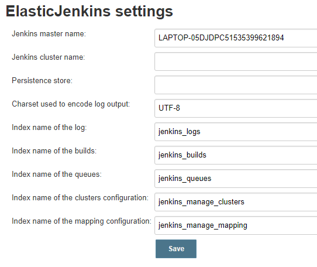
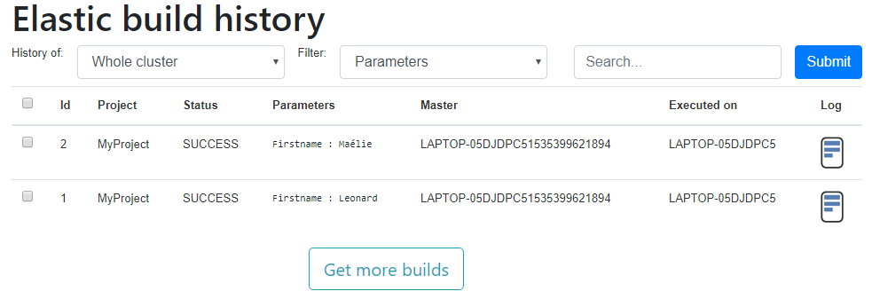
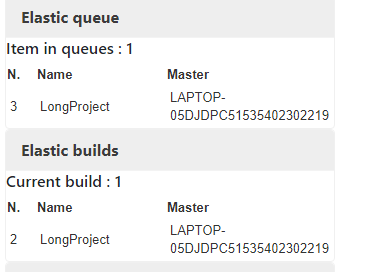

# ElasticJenkins plugin

## Disclaimer
Copyright (c) 2018, Mathieu COAVOUX

Permission to use, copy, modify, and/or distribute this software for
any purpose with or without fee is hereby granted,
provided that the above copyright notice and this permission notice appear in all copies.

THE SOFTWARE IS PROVIDED "AS IS" AND THE AUTHOR DISCLAIMS ALL WARRANTIES
WITH REGARD TO THIS SOFTWARE INCLUDING ALL IMPLIED WARRANTIES OF MERCHANTABILITY AND FITNESS.
IN NO EVENT SHALL THE AUTHOR BE LIABLE FOR ANY SPECIAL, DIRECT, INDIRECT, OR CONSEQUENTIAL DAMAGES
OR ANY DAMAGES WHATSOEVER RESULTING FROM LOSS OF USE, DATA OR PROFITS, WHETHER IN AN ACTION OF CONTRACT,
NEGLIGENCE OR OTHER TORTIOUS ACTION, ARISING OUT OF OR IN CONNECTION
WITH THE USE OR PERFORMANCE OF THIS SOFTWARE.

## Overview

### Purpose
This plugin has been created to save queued jobs and builds into a central persistence store.
Indeed we need to keep track of all past operations that has been performed on the production servers.

Elasticsearch is the only available persistence store at this stage of the plugin.
All current and terminated builds status and logs can be retrieve from a single place.
Therefore we can manage and view history of multiple Jenkins, including terminated Jenkins container.

### Architecture
Whenever a build is triggered the ElasticJenkins plugin is executed, if the wrapper is enabled.
ElasticJenkins takes the Jenkins master name, which is defined under the management console and the project name.
The status of the build is recorded in Elasticsearch at every stage.


Builds are stored into Elasticsearch with their *master name*. The *master name* is defined under the management console.
This name must be unique as this is use to identify which server has executed what.

#### Design explanations
As per explained before the main objective to store logs in one place is to keep track of what has been built on the platform.
Moreover we would like to have active-active Jenkins and if one failed another can take the not-started build over or 
relaunch a build at the stage where it failed.

We explain here how and why we designed the model in the persistence store.

The decisions taken below can changed in the future based on the issues we may encounter.

##### Why Elasticsearch?
Elasticsearch is designed to store document, it can be a simple key-value document or a large text file. 
Hence we can store both the build result and the log output in the same store.

As elasticsearch is a NO-SQL database it allows us to dynamically allocate shards if the number of builds growth significantly.

Finally the last main reason that we chose Elasticsearch, is that we can use Kibana application to create reports of our builds, or even search for a build.
This can be used by a customer which doesn't have an access to the Jenkins server or because the server is no longer available as it was a temporary container.

##### Why using the hash of the project as an index?
Jenkins allows to have any characters as the project name as we want to ensure that the index has only alpha-numerical characters we used the MD5 hash.

##### Why do we create an index per project and not storing every build into a single one.
We want to display the latest build first in the history. If we stored every build into a single index we would need to 
take all builds for a specific project and then sort the result. 
As per mentioned into the Elasticsearch documentation the sort operation may consume a lot of memory as we need to 
take all results before sorting them. 

This can be even more painful we want to paginate the history results to the user. Each time we need to take all results and then split them in pages.

By dedicating an index for a project we can sort the result based on the id and consequently no need to get all the results.

##### Why do we store logs output into another index?
As we are using the index to create report a search for a build based on parameters or status we want to keep those documents as light as possible.
We assume that we will access more of the build status rather than its log output.

##### Why do we create a date index for the log?
We assume that a log output of a build perform during the current month will be accessed more than a build performed long time ago. 
We can decrease the priority and the redundancy of an old log and even remove index for very old logs easily.

##### Why not storing multiple types in an index?
This was our initial designed to keep track of the builds and enqueued operation in the same index 
but in different types. Unfortunately, Elasticsearch is not allowing us to do such design in new versions,
for good reasons.

## Elasticsearch

We use the REST api to store, retrieve or delete builds. We wanted to use the REST API rather than the SDK for several reasons:
* The REST API basic operations doesn't differ between Elasticsearch version
* There is no need to add the Elasticsearch transport which has been changed between some major versions
* We don't overload the classloader with all Elasticsearch dependencies that can be in conflict with others plugins

### Model

Below the information stored in Elasticsearch


## Installation

Since this plugin is under development you may install it by downloading the source code and compiling it.
You can compile with the command :
```
mvn package
```

Or if you don't have Elasticsearch install on the server where you are compiling the source code or you want to skip the tests:

```
mvn -DskipTests -Dmaven.test.skip=true package
```

Once the plugin compiled, a HPI file must be available under the target.
Boot your Jenkins. Then click on Manage / Manage Plugins / Advanced tab
Then choose the HPI file in the Upload plugin section.
After the plugin installation configure the plugin
## Configuration

Under the manage console click on *Elasticjenkins management* 
Then fill the form:


* Jenkins master name: this is used to identify the server where the build has been launched
* Jenkins cluster name: this is used to display all builds launched in the same cluster
* Persistence store: this is the URL of Elasticsearch. Example: http://localhost:9200
* Index name of the log: this is used to create an index which contains the log
* Index name of the builds: this is used to create an index which contains the builds
* Index name of the queues: this is used to create an index which contains the items in queues
* Index name of the clusters configuration: this is used to create an index which contains the clusters configuration
* Index name of the mapping configuration: this is used to create an index which contains the Jenkins projects configuration

Then press save.
You must receive an success message:


## Usage

When you create your Jenkins Job you must select the ElasticBuild box in the Build Environment section:


You may notice that an icon appears on the left panel under your project:


Click on it to view the builds history stored into Elasticsearch


You can filter the view either to display all builds for the whole cluster or only the current node.
You can also search for a build based on a parameter 

Finally you can see that two new widgets are available.



They display the current items in the queue for the cluster and the current buils.