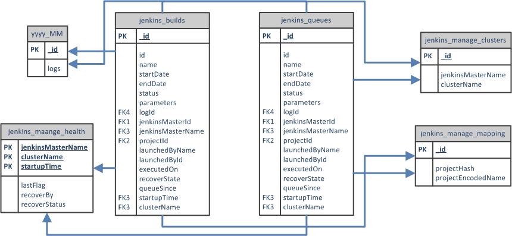

# ElasticJenkins plugin

## Disclaimer
Copyright (c) 2018, ComprehensiveIT®, Mathieu COAVOUX

Permission to use, copy, modify, and/or distribute this software for
any purpose with or without fee is hereby granted,
provided that the above copyright notice and this permission notice appear in all copies.

THE SOFTWARE IS PROVIDED "AS IS" AND THE AUTHOR DISCLAIMS ALL WARRANTIES
WITH REGARD TO THIS SOFTWARE INCLUDING ALL IMPLIED WARRANTIES OF MERCHANTABILITY AND FITNESS.
IN NO EVENT SHALL THE AUTHOR BE LIABLE FOR ANY SPECIAL, DIRECT, INDIRECT, OR CONSEQUENTIAL DAMAGES
OR ANY DAMAGES WHATSOEVER RESULTING FROM LOSS OF USE, DATA OR PROFITS, WHETHER IN AN ACTION OF CONTRACT,
NEGLIGENCE OR OTHER TORTIOUS ACTION, ARISING OUT OF OR IN CONNECTION
WITH THE USE OR PERFORMANCE OF THIS SOFTWARE.

## Overview

### Purpose
This plugin has been created to save queued jobs and builds into a central persistence store.
Indeed we need to keep track of all past operations that has been performed on the production servers.

Elasticsearch is the only available persistence store at this stage of the plugin.
All current and terminated builds status and logs can be retrieve from a single place.
Therefore we can manage and view history of multiple Jenkins, including terminated Jenkins container.

### Architecture
Whenever a build is triggered the ElasticJenkins plugin is executed, if the wrapper is enabled.
ElasticJenkins takes the Jenkins master name, which is defined under the management console and the project name.
The status of the build is recorded in Elasticsearch at every stage.

Builds are stored into Elasticsearch with their *master name*. The *master name* is defined under the management console.
This name must be unique as this is use to identify which server has executed what.

## Elasticsearch

We use the REST api to store, retrieve or delete builds. We wanted to use the REST API rather than the SDK for several reasons:
* The REST API basic operations doen't differ between Elasticsearch version
* There is no need to add the Elasticsearch transport which has been changed between some major versions
* We don't overload the classloader with all Elasticsearch dependencies that can be in conflict with others plugins

### Model

Below the information stored in Elasticsearch

## Configuration

## Usage